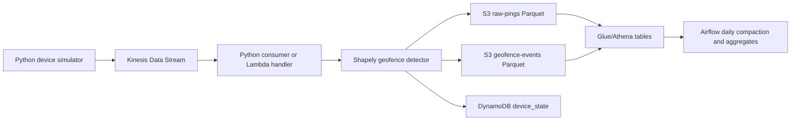
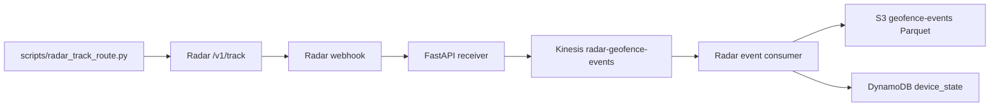

# Real-Time Geofence Event Pipeline

Local-first streaming pipeline that simulates device GPS pings, publishes them to AWS Kinesis, detects geofence entry and exit events with Shapely, and routes raw/events data to S3 Parquet plus DynamoDB device state. It mirrors Radar-adjacent data platform patterns: Kinesis, S3, Athena, Airflow, Parquet, and Python.

## Architecture



## What Is Built

- Six NYC polygon geofences: Times Square, Central Park South, Brooklyn Bridge, JFK Airport, Grand Central, and Union Square.
- Simulator for 50-100 moving devices using route anchors and random walk jitter.
- Kinesis producer that writes `{device_id, lat, lng, timestamp, speed}` pings.
- Kinesis consumer and Lambda handler that detect `ENTER` and `EXIT` state changes.
- S3 Parquet sinks:
  - `raw-pings/year=/month=/day=/hour=/`
  - `geofence-events/year=/month=/day=/`
- DynamoDB hot state table keyed by `device_id`.
- Athena DDL and example analytical queries.
- Airflow DAG skeleton for compaction, daily aggregates, and freshness checks.
- FastAPI Radar webhook receiver for Phase 2.

## Quick Start

```bash
python3.11 -m venv .venv
source .venv/bin/activate
pip install -r requirements-dev.txt
cp .env.example .env
docker compose up -d
python scripts/bootstrap_localstack.py
```

Start the consumer in one terminal:

```bash
python -m geofence_pipeline.consumer.run --flush-size 25
```

Start the simulator in another terminal:

```bash
python -m geofence_pipeline.simulator.run --devices 75 --max-events 1000
```

Inspect LocalStack output:

```bash
aws --endpoint-url=http://localhost:4566 s3 ls s3://radar-pipeline-local/raw-pings/ --recursive
aws --endpoint-url=http://localhost:4566 s3 ls s3://radar-pipeline-local/geofence-events/ --recursive
aws --endpoint-url=http://localhost:4566 dynamodb scan --table-name device_state
```

## Configuration

Environment variables are loaded from `.env`.

| Variable | Default | Purpose |
| --- | --- | --- |
| `AWS_REGION` | `us-east-1` | AWS/LocalStack region |
| `AWS_ENDPOINT_URL` | `http://localhost:4566` | Set empty for real AWS |
| `KINESIS_STREAM_NAME` | `location-pings` | Input ping stream |
| `S3_BUCKET` | `radar-pipeline-local` | Parquet data lake bucket |
| `DYNAMODB_TABLE` | `device_state` | Hot state table |
| `SIMULATOR_DEVICE_COUNT` | `75` | Number of simulated devices |
| `SIMULATOR_INTERVAL_SECONDS` | `1.5` | Producer loop sleep |
| `SIMULATOR_BATCH_SIZE` | `25` | Pings per producer batch |

## Athena

Create the database first, then run [infra/athena/create_tables.sql](/Users/ninghan/CascadeProjects/StreamingProject/infra/athena/create_tables.sql). Example product analytics queries live in [infra/athena/example_queries.sql](/Users/ninghan/CascadeProjects/StreamingProject/infra/athena/example_queries.sql):

- daily unique visitors by geofence
- average and median dwell time
- devices visiting multiple geofences in one day
- peak entry hour by geofence

For local development the SQL uses `s3://radar-pipeline/...`; replace it with your configured bucket, such as `s3://radar-pipeline-local/...`.

## Phase 2: Radar Webhooks

The FastAPI receiver in [src/geofence_pipeline/api/radar_webhook.py](/Users/ninghan/CascadeProjects/StreamingProject/src/geofence_pipeline/api/radar_webhook.py) accepts Radar webhook events, normalizes `user.entered_geofence` and `user.exited_geofence` payloads, and publishes them to the `radar-geofence-events` Kinesis stream.

Radar Phase 2 flow:



Radar's webhook docs currently specify `X-Radar-Signature` as an HMAC-SHA1 hash of the `X-Radar-Signing-Id` header using the webhook security token. Local signature validation is disabled by default with `RADAR_VALIDATE_SIGNATURE=false`; set it to `true` when using an actual Radar webhook security token.

```bash
uvicorn geofence_pipeline.api.radar_webhook:app --reload --port 8000
```

For local testing with Radar, expose it with ngrok:

```bash
ngrok http 8000
```

Set the Radar webhook URL to:

```text
https://<ngrok-host>/webhooks/radar
```

Run the Radar event consumer in another terminal:

```bash
python -m geofence_pipeline.consumer.radar_events --flush-size 5
```

For a local-only Phase 2 smoke test without a Radar account, send a sample Radar-shaped webhook:

```bash
python scripts/send_sample_radar_webhook.py
```

For a real Radar test, set your test publishable key in `.env`:

```text
RADAR_PUBLISHABLE_KEY=prj_test_pk_...
RADAR_VALIDATE_SIGNATURE=true
RADAR_WEBHOOK_SECRET=<webhook security token from Radar dashboard>
```

Then send sample track calls to Radar:

```bash
python scripts/radar_track_route.py --user-id phase2_demo_user
```

Radar will generate webhook events when the user enters or exits geofences configured in the Radar dashboard, then this project routes those events through Kinesis to S3 Parquet and DynamoDB.

## Tests

```bash
pytest
ruff check .
```

## Resume Bullet

Built a real-time geofence event streaming pipeline using AWS Kinesis, Lambda, S3 Parquet, DynamoDB, and Athena; simulated 75+ device location pings with Shapely-based geofence entry/exit detection, multi-sink routing, Airflow daily aggregation DAGs, and an Athena analytics layer for dwell time and visit frequency queries.
